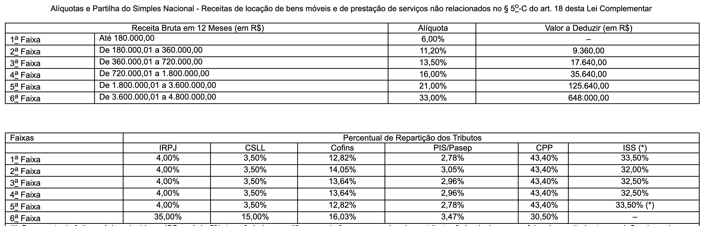

By: Luydi Bentes
Considerando os anexos e faixas:

Link: https://www.planalto.gov.br/ccivil_03/leis/lcp/lcp123.htm

Perceba que alguns valores dos tributos mudam de acordo com as faixas:

No código já foi feita a parte das aliquotas e todas as suas faixas, oque deve ser feito agora é considerar que cada faixa vai calcular com um valor diferente, e alguns anexos não precisam de alguns impostos como é possivel ver abaixo.

Anexo 1:

Aenxo 2:

Anexo 3:

Anexo 4:

Anexo 5:

